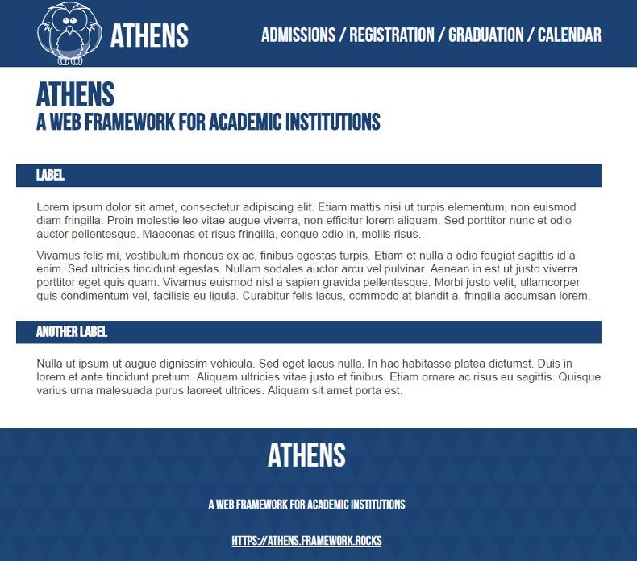

# Theme

An example theme for the [Athens](https://github.com/Athens/Core) web framework.


<br>
*Create your own theme for easy, attractive, on-brand pages*

# Features

## Responsive

## Advanced Field Editors

# Use

These templates are for the [Athens](https://github.com/Athens/Core) web framework. You must be using Framework to use these templates.

The following steps are described in the Athens [application creation tutorial](https://github.com/Athens/Core/blob/master/doc/application-creation.md). If you are new to Athens, you may wish to use that tutorial instead.

1. Add the example theme to the package requirements in your `composer.json`:

  ```
  "require": {
        ...
        "athens/core": "0.*",
        "athens/theme": "0.*",
        ...
  },
  ```
  
  The major version number of `athens/theme` should be the same as your major version number of `athens/core`.

2. Add the example templates in your project's `setup.php`, **above** the line that adds your project-templates:
  ```
  Settings::addTemplateDirectory(dirname(__FILE__) ."/vendor/athens/theme/templates");
  Settings::addTemplateDirectory(dirname(__FILE__) ."/project-templates");
  ```
  
That's it. Your Athens project is now using the example theme!

